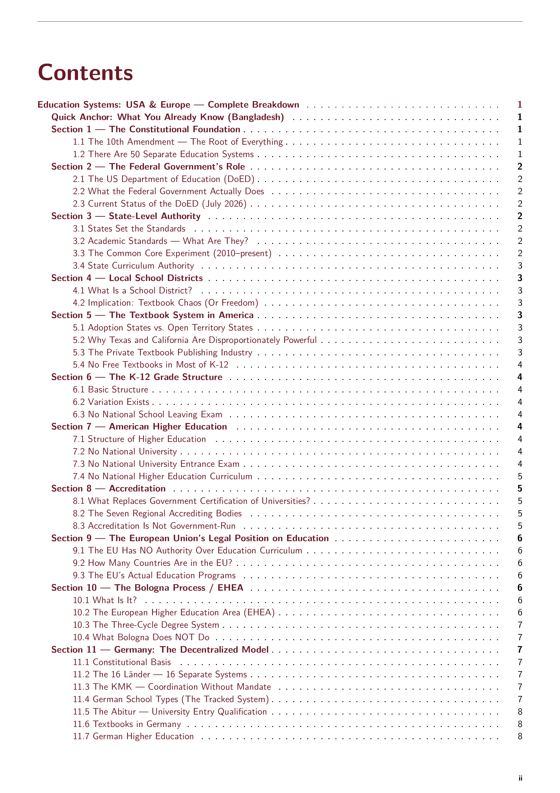
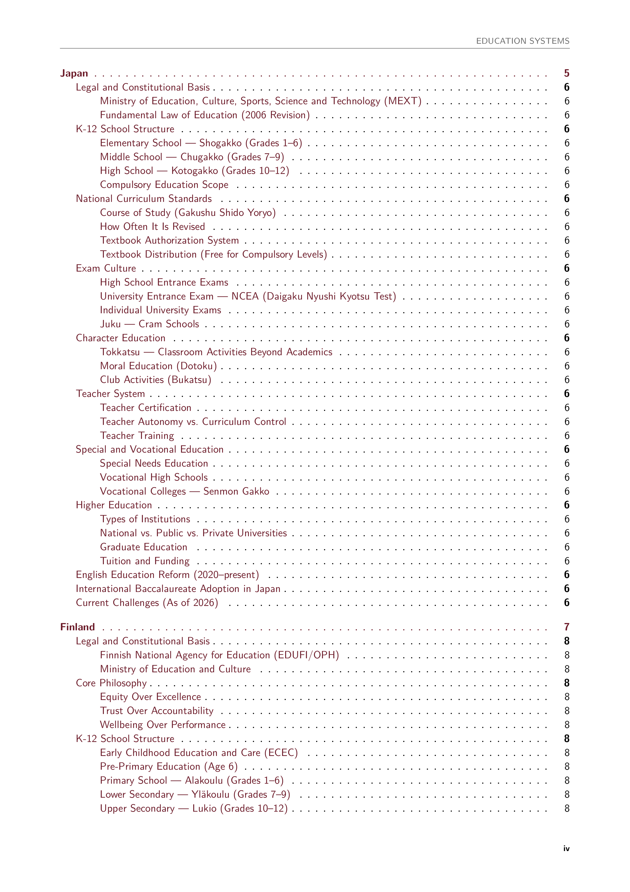
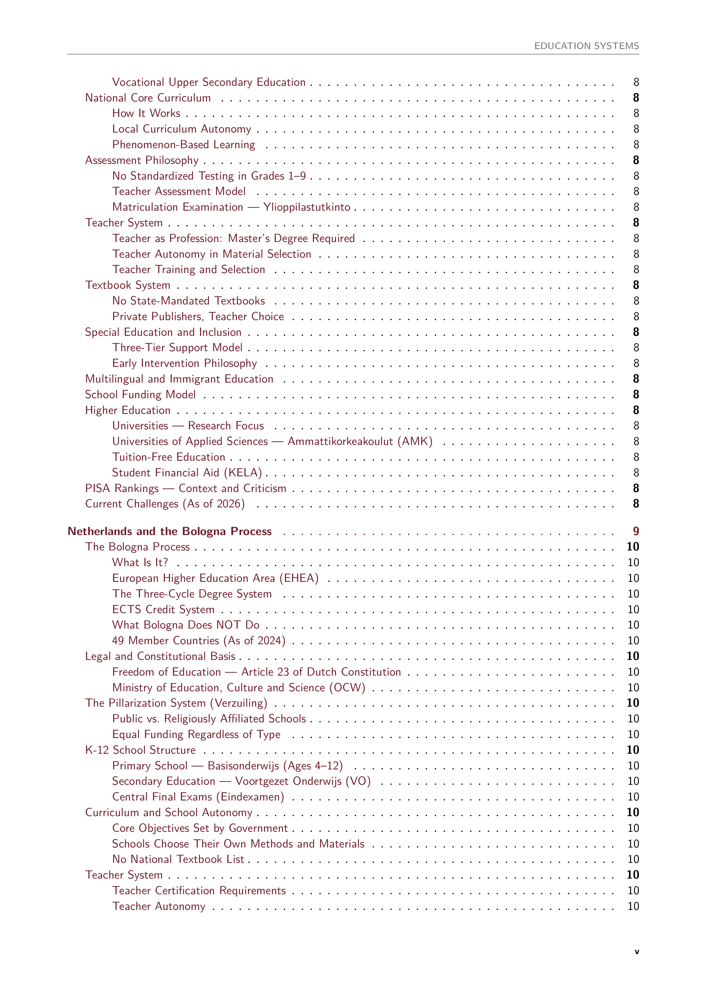
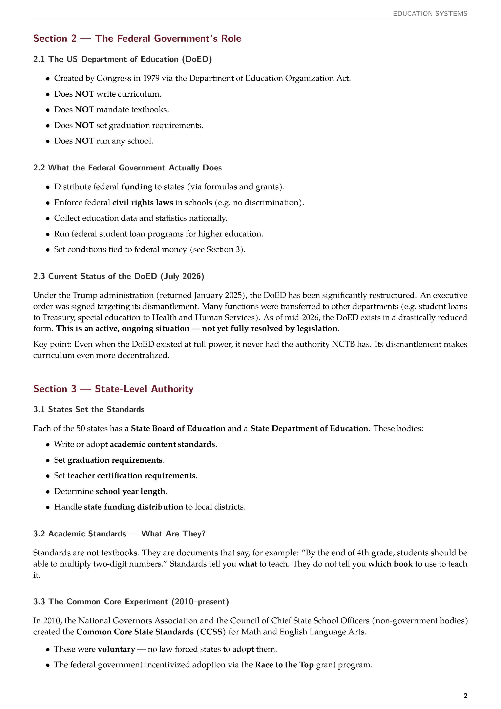
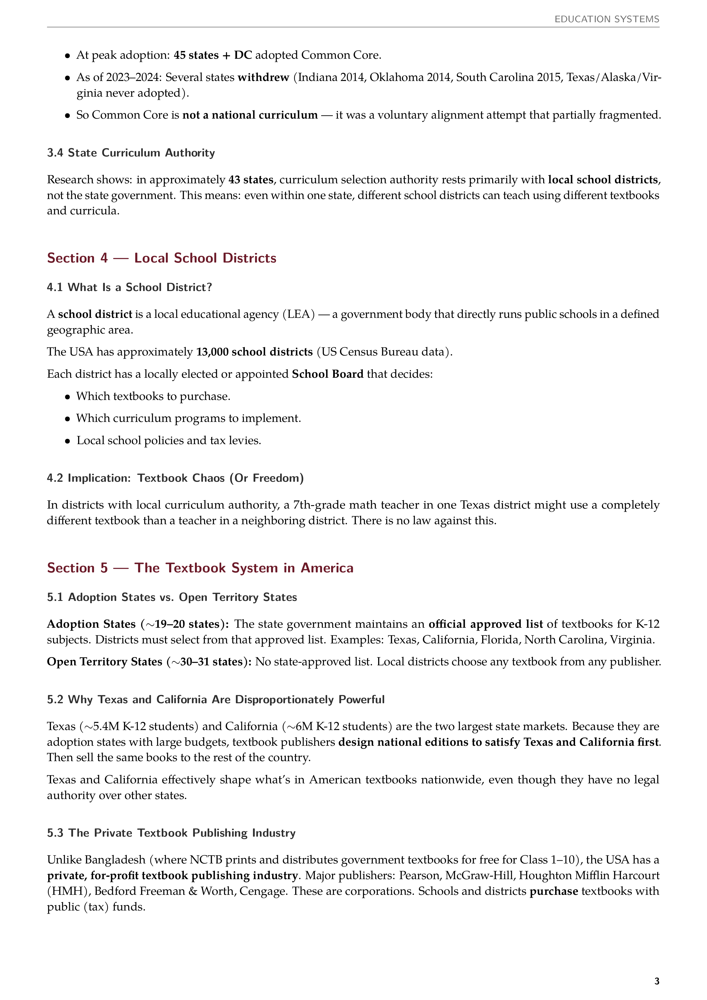
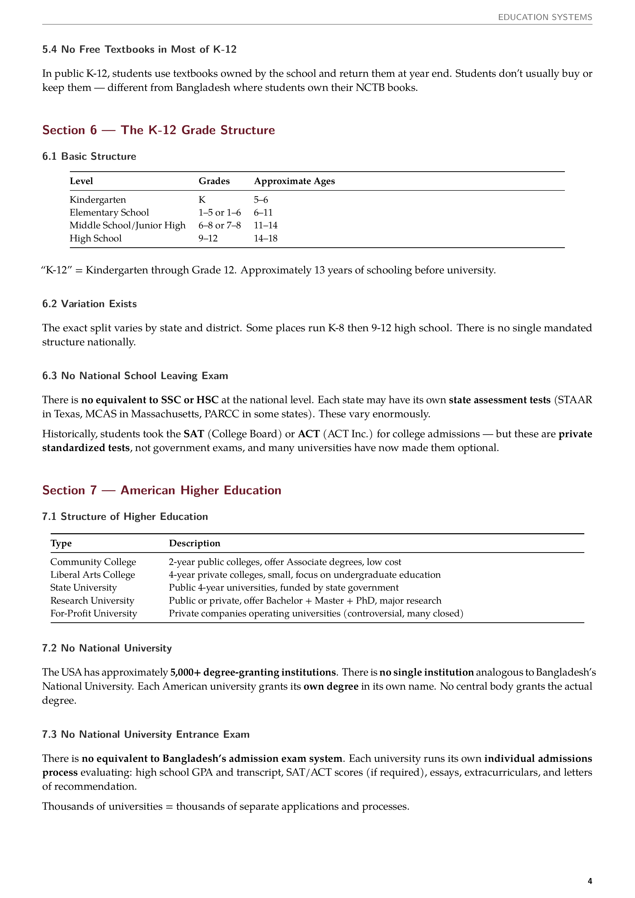
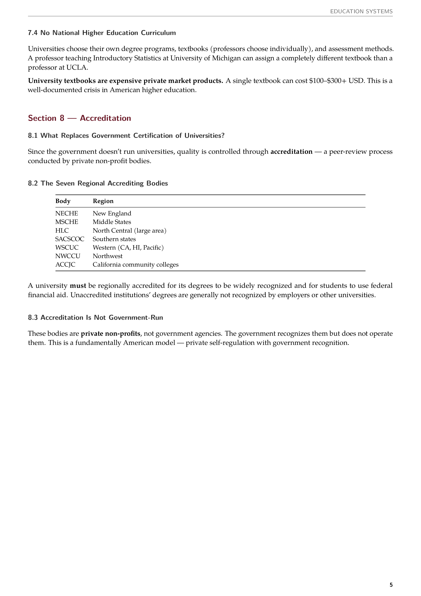

# Compendium

Structured knowledge documents in LaTeX.

---

## Education Systems: USA & Europe

Comprehensive breakdown of K–12 and higher education systems across the United States and Europe.

**[View folder](ed-sys)** | **[Build](#build)**

| | | | |
|---|---|---|---|
| [](assets/ed-sys-01.png) | [](assets/ed-sys-02.png) | [](assets/ed-sys-03.png) | [](assets/ed-sys-04.png) |
| [](assets/ed-sys-05.png) | [](assets/ed-sys-06.png) | [](assets/ed-sys-07.png) | [](assets/ed-sys-08.png) |

---

## Next Project Title Here

Description of next project.

**[View folder](next-project-folder)** | **[Build](#build)**

| | | | |
|---|---|---|---|
| [](assets/next-01.png) | [](assets/next-02.png) | [](assets/next-03.png) | [](assets/next-04.png) |

---

## Build Requirements

- LaTeX distribution with `latexmk` and `lualatex`
- TeX Gyre fonts (Pagella, Heros Condensed)

## Build

```bash
cd ed-sys
latexmk main.tex
```

## License

No license. All rights reserved.
